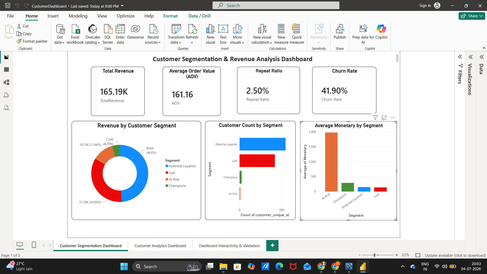
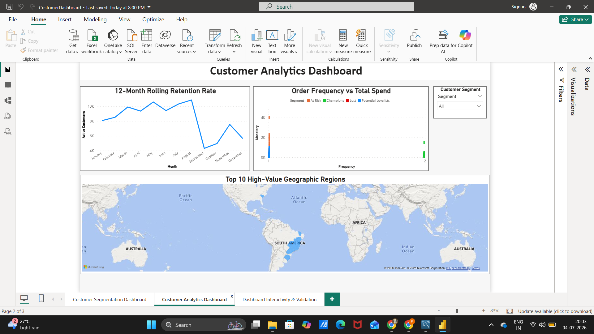
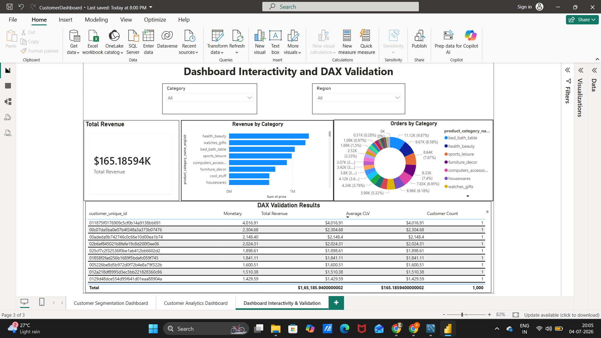

# E-Commerce Customer Retention & Lifetime Value Optimizer

## Project Overview

This project analyzes the Olist Brazilian E-Commerce dataset to understand customer purchasing behavior, identify high-value customers, measure customer retention, and predict customer churn.

The project combines SQL, Python, Machine Learning, and Power BI to provide business insights and support data-driven decision-making.

---

## Objectives

- Clean and preprocess e-commerce data
- Perform RFM (Recency, Frequency, Monetary) Analysis
- Build Monthly Cohort Retention Analysis
- Identify High-Value Product Categories
- Calculate Average Order Value (AOV)
- Calculate Repeat Purchase Ratio
- Segment customers using K-Means Clustering
- Predict customer churn using Random Forest
- Visualize business insights using Power BI

---

## Dataset

**Dataset:** Olist Brazilian E-Commerce Dataset

Source:
https://www.kaggle.com/datasets/olistbr/brazilian-ecommerce

---

## Technologies Used

- SQL (MySQL)
- Python
- Pandas
- NumPy
- Scikit-learn
- Matplotlib
- Seaborn
- Joblib
- Power BI
- Jupyter Notebook

---

## Project Workflow

```
Raw Dataset
      │
      ▼
SQL Data Cleaning
      │
      ▼
Feature Engineering
      │
      ▼
RFM Analysis
      │
      ▼
Cohort Analysis
      │
      ▼
Customer Segmentation
      │
      ▼
Churn Prediction
      │
      ▼
Power BI Dashboard
```

---

## SQL Analysis

The SQL phase includes:

- Data Cleaning
- Missing Value Handling
- Referential Integrity Checks
- Date Standardization
- RFM Analysis
- Cohort Analysis
- Monthly Retention Analysis
- High-Value Product Category Analysis
- Average Order Value (AOV)
- Repeat Purchase Ratio

---

## Python Analysis

The Python notebook performs:

- Data Loading
- Data Cleaning
- Feature Engineering
- Standard Scaling
- K-Means Clustering
- Customer Segmentation
- Churn Prediction
- Model Evaluation

---

## Machine Learning

Model Used:

- Random Forest Classifier

Evaluation Metrics:

- Accuracy
- Precision
- Recall
- F1-Score

Output:

- Customer Churn Prediction
- Churn Probability Scores
- Trained Model (.pkl)

---

## Power BI Dashboard

The dashboard includes:

- KPI Cards
- Customer Segmentation
- Revenue Analysis
- Customer Retention
- Monthly Cohort Analysis
- High-Value Product Categories
- Customer Churn Insights

---

## Project Structure

```
Customer-Retention-Lifetime-Value-Optimizer
│
├── Dataset
├── Images
├── Models
├── PowerBI
├── Python
├── SQL
├── README.md
└── requirements.txt
```

---

## Results

- Built customer segments using RFM Analysis and K-Means Clustering.
- Calculated Monthly Customer Retention using Cohort Analysis.
- Identified high-value customers and product categories.
- Predicted customer churn using Random Forest.
- Developed an interactive Power BI dashboard for business insights.

---

## Future Improvements

- Deploy the model as a web application
- Automate data refresh
- Improve churn prediction with advanced models
- Add real-time customer analytics

---

## Dashboard Preview

### Customer Segmentation Dashboard



### Customer Analytics Dashboard



### Dashboard Interactivity & DAX Validation



## Author

**Srilekha Mummadi**

GitHub:
https://github.com/srilekha521

LinkedIn:
https://www.linkedin.com/in/srilekha-mummadi
